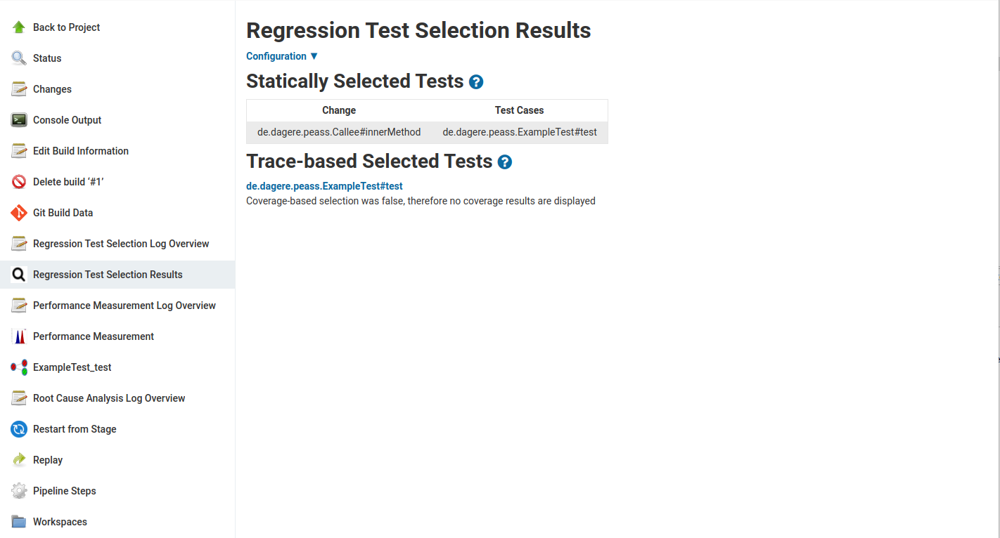
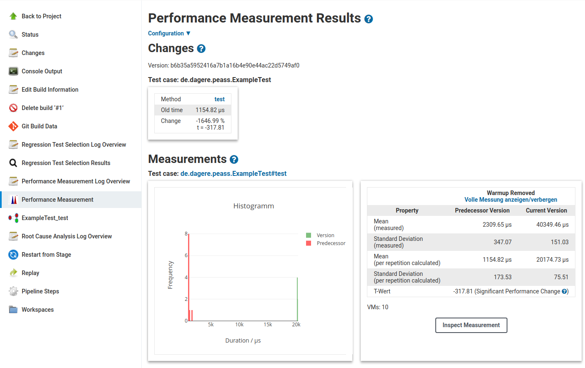
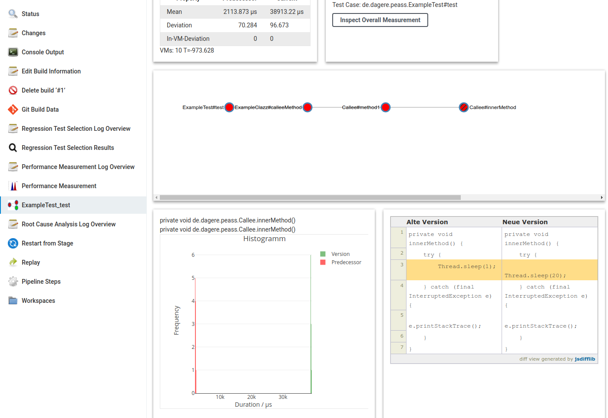

Peass-CI
===================

Detecting and understanding performance changes is hard: Commits (often) contain many changes, so it is hard to keep track of every effect on the performance, and optimizations of the JVM might cause code changes to have unexpected side effects. By measuring the performance with statistic rigor, we can detect and understand perfromance changes and thereby avoid regressions.

The Peass-CI-Plugin enables a continuous performance measurement for Java projects in an Jenkins server. Peass-CI currently supports the following workload types:
- JUnit 3,4 or 5 tests (which are transformed into performance unit tests)
- JMH benchmarks.

Currently, JUnit tests can be measured for maven and Gradle projects and JMH benchmarks only for maven projects.

By integrating Peass-CI in your build process, you will get performance measurements of each JUnit test or JMH benchmark and hints when regressions have occured. Furthermore, Peass-CI creates a call tree of the unit test or benchmark, which pinpoints the root cause of your performance changes. Therefore, the following steps are executed:
- Regression Test Selection: The unit tests which may have changed performance based on the current commit will be selected by a combination of static and dynamic code analysis.
- Performance Measurement: The selected tests will be executed (repeating them inside a VM and restarting the JVM, as often as you specify it, both for the current and the predecessor version) to identify performance changes.
- Root Cause Analysis: For every identified performance change, the measurement will be repeated with additional instrumentation of your call tree to identify the method call(s) which cause your performance change (optional).

# Usage

## Configuration
After installing Peass-CI in your Jenkins, you'll have the measurement step available in your build process. 

If you are using pipeline jobs, you may add a performance measurement step like this:

```
stage('measure performance') {
   steps {
      measure VMs: 100, iterations: 10, warmup: 10, repetitions: 1000
   }
}
```

If you are using classic freestyle jobs, the build step will be called "Measure Version Performance".

Since Peass-CI does not support parallel builds, please also add ` options { disableConcurrentBuilds() }` to your job. Furthermore, performance measurements may get flaky if too much load is on your system. Therefore, if you only have one Jenkins node (and not several agents to run your measurements at), consider limiting the parallel job builds of your Jenkins instance.

After you added this stage, each build will contain performance measurements (if a code that is called by a unit test or benchmark is changed - there will be no measurements if only documentation changes).  See the [Wiki entry for measurement process configuration](https://github.com/DaGeRe/peass/wiki/Configuration-of-Measurement-Processes) for starting points for configuring the measurement step for your project.

## Credentials

Sometimes, your build requires credentials, e.g. the you have a own Nexus-Server for storing your libraries and want to start your build with `-PmavenPassword=$NEXUS_PASSWORD -PmavenUser=$NEXUS_USER`. To add these to Peass-CI, you'll need to set the `properties` flag. Since you do not want the password to appear in your logs, you'll additionally need to pass the `usernamePassword`-credentials to Peass-CI.

Therefore, your job with credentials might look like this:
```
  withCredentials([usernamePassword(credentialsId: 'myCredentialId', usernameVariable: 'NEXUS_USER', passwordVariable: 'NEXUS_PASSWORD')]){ 
    script {
      measure properties: "-PmavenPassword=$NEXUS_PASSWORD -PmavenUser=$NEXUS_USER",
        ...
      }
    }
  }
```

If you have other credentials that you pass to processes and the current masking approach does not work for you, feel free to file an issue.

## Example

After successfull measurement execution, you will get three things:
- the regression test selection result (telling you which tests were measured),
- the measurement result and
- the root cause analysis result (if not disabled and statistically significant changes were measured).

For our simple demonstration, the regression test selection result looks like this:


We can see here, that the `innerMethod` in the class `Callee` was changed, and that this changed class is called by the test method `ExampleTest#test`. The trace analysis confirms this test selection. By clicking on `Configuration` you can see the corresponding configuration (which you might change for a re-run in your job) and you can see the traces with the method source when clicking on the test case.

Since `ExampleTest#test` was selected, we can see the following measurement afterwards

In the *Changes* section, we can see that test method `test` was selected as a performance change. In the *Measurements* section, we see that the histogram clearly show the performance difference and that the measured values also clearly indicate the performance change. By clicking on *Inspect Measurement* we could see more measurent details.

In the regression test selection, we see the call tree.

Red indicates a performance regression in the node and green an improvement. Nodes with stripes indicate a source code change. In this example, we see that a `Thread.sleep` was increased from 1 to 20 and therefore the unit test got slower.

## Inspection

If you need more detailed information about the measurements and their results, there are two main options to inspect the measurement process: The logs and the measurement dashboard. 

For regression test selection, measurement and root cause analysis, several executions of your software are necessary. If there is unexpected behaviour, these logs might be useful. To inspect the logs of any stage, click on the corresponding log overview. For measurements, the VM is started several times; here you can find a log for each run for both the current and the predecessor version.


Finally, if you want to look at the performance of individual nodes or the overall measurement in more detail, click on the *Inspect Measurement* buttons of the particular node or the overall measurement of the test case. 

When looking at this, you can see the histogram of the averages of you VM runs and the evolution of the measurements inside a VM. You can select a subset of VM runs or change the selected iterations and thereby get a better understanding of the performance measurement.


# Known Problems
- Peass only works if you use the latest version of JUnit, i.e. 4.13.x or 5.8.x, or JMH, i.e. 1.33. If you import an older version of JUnit (or it is imported by plugins you use, e.g. spring boot), please update your JUnit dependency. It is currently not possible to maintain and check the compatibility with older versions of the testing / benchmarking tools. 

# Development

Building and updating to the latest Peass version from git is only required if you need the latest changes, e.g. if you want to change something yourself or you want to check whether a bug has been fixed. Otherwise, just use the release.

If you see an error, do not hesitate to file an issue. If you know what you are doing, you can also create a PR, but we will only merge working PRs.

## Building

Peass-CI relies on the Peass-libraries. To build them, get peass by running `git clone https://github.com/DaGeRe/peass.git && cd peass && mvn clean install -DskipTests -P buildStarter` (to build the full Peass project, and not only the basic libraries, the profile `buildStarter` needs to be built). Then, execute `mvn clean package` for the peass-ci-plugin.

For testing, run `mvn hpi:run` and access `localhost:8080/jenkins`. 

## Development Version Running

To install the latest Peass-CI to your Jenkins installation, you may either upload it through the website (Manage Jenkins -> Manage Plugins -> Advanced -> Upload Plugin) or stop Jenkins, copy `target/peass-ci.hpi` to `~/.jenkins/plugins` (or wherever your Jenkins home is) and restart Jenkins. Afterwards, when configuring your project, the `measure`-step is available. 

# License

Peass-CI is **licensed** under the **[MIT License]** and **[AGPL License]**.

[MIT License]: https://github.com/DaGeRe/peass-ci/blob/main/LICSENSE.MIT
[AGPL License]: https://github.com/DaGeRe/peass-ci/blob/main/LICENSE.AGPL
